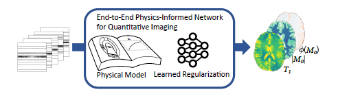
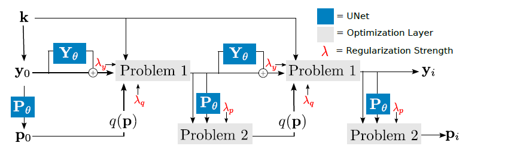
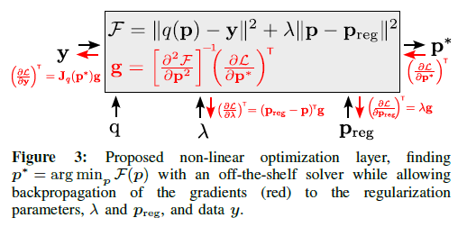
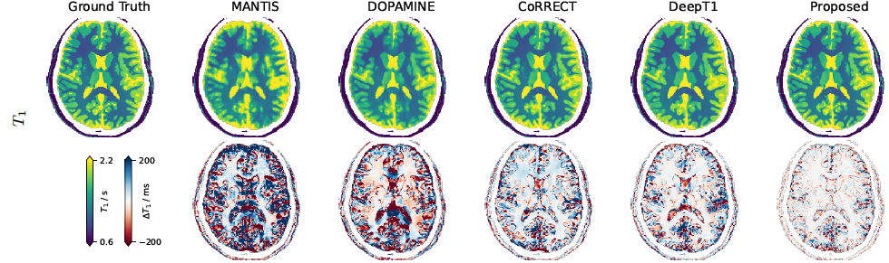

# PINQI: End-to-End Physics-Informed Quantitative MRI Reconstruction

[](https://arxiv.org/abs/2306.11023)
[](https://doi.org/10.1109/TCI.2024.3388869)

## Overview

This repository contains the official implementation of the methods from the paper:

**PINQI: an end-to-end physics-informed approach to learned quantitative MRI reconstruction**  
Felix F. Zimmermann, Christoph Kolbitsch, Patrick Schuenke, Andreas Kofler  
*IEEE Transactions on Computational Imaging, 2024*  
[[arXiv:2306.11023](https://arxiv.org/abs/2306.11023)] | [[IEEE](https://doi.org/10.1109/TCI.2024.3388869)]

**Goal:** Reconstruct quantitative tissue parameter maps directly from undersampled k-space data by integrating MR physics knowledge into an end-to-end trainable neural network.



---

### Abstract

> Quantitative Magnetic Resonance Imaging (qMRI) enables the reproducible measurement of biophysical parameters in tissue. The challenge lies in solving a nonlinear, ill-posed inverse problem to obtain the desired tissue parameter maps from acquired raw data. While various learned and non-learned approaches have been proposed, the existing learned methods fail to fully exploit the prior knowledge about the underlying MR physics, i.e. the signal model and the acquisition model. In this paper, we propose PINQI, a novel qMRI reconstruction method that integrates the knowledge about the signal, acquisition model, and learned regularization into a single end-to-end trainable neural network. Our approach is based on unrolled alternating optimization, utilizing differentiable optimization blocks to solve inner linear and non-linear optimization tasks, as well as convolutional layers for regularization of the intermediate qualitative images and parameter maps. This design enables PINQI to leverage the advantages of both the signal model and learned regularization. We evaluate the performance of our proposed network by comparing it with recently published approaches in the context of highly undersampled $T_1$-mapping, using both a simulated brain dataset, as well as real scanner data acquired from a physical phantom and in-vivo data from healthy volunteers. The results demonstrate the superiority of our proposed solution over existing methods and highlight the effectiveness of our method in real-world scenarios.

---

## The PINQI Method

The core of PINQI is an unrolled alternating optimization algorithm. It iteratively refines intermediate qualitative images and the final quantitative parameter maps. Each iteration involves:

1. **Data Consistency:** Solving a linear inverse problem incorporating the MR physics (encoding operator `A`, sensitivity maps `C`, etc.) and regularization on the intermediate images (`y`).
2. **Parameter Map Update:** Solving a non-linear inverse problem using the current intermediate image to update the tissue parameter maps (`x`).
3. **Learned Regularization:** Neural networks are used within the optimization steps to regularize the intermediate images and parameter maps.

This process is implemented as an end-to-end trainable network, leveraging differentiable optimization blocks for the data consistency and parameter update steps.


*(Detailed flowchart of the unrolled alternating optimization steps in PINQI.)*


*(Illustration of the differentiable optimization layers used for solving the inner subproblems.)*

The specific implementation can be found in [E2E/model/solutions/pinqi.py](E2E/model/solutions/pinqi.py).

---

## Example Results (T1 Mapping)

Below is an example comparison of T1 maps reconstructed using PINQI and various reference methods from highly undersampled data, demonstrating the performance improvements achieved by PINQI.


*(Comparison of T1 reconstruction results on simulated Brainweb data for PINQI and reference methods.)*

---

## Repository Contents

This repository provides:

- Implementation of the **PINQI** method ([pinqi.py](E2E/model/solutions/pinqi.py))
- Reference and baseline methods evaluated in the paper:
  - Conjugate Gradient and BFGS-based solvers
  - Deep cascade methods (e.g., DeepT1)
  - Unrolled optimization networks (e.g., UnrolledGN, DEMO)
  - Primal-dual networks
  - Other state-of-the-art approaches (e.g., DOPAMINE, MANTIS)
- A sophisticated and flexible UNet implementation supporting 2D, 2.5D (patch-based 3D), and 3D data, along with other network architectures ([E2E/net](E2E/net)).
- Modular qMRI problem definitions (forward model, sequence parameters, etc.) (e.g., [T1BrainwebCart.py](E2E/model/problems/T1BrainwebCart.py)).
- A training and evaluation framework built on PyTorch Lightning.
- Tools for generating synthetic qMRI training data based on the Brainweb phantom ([E2E/data](E2E/data)).
- Integration with Neptune.ai for experiment tracking.

## Project Structure

```
pinqi/
├── E2E/
│   ├── data/                # Data loading, simulation, Brainweb utilities
│   ├── model/
│   │   ├── problems/        # qMRI problem definitions (forward models)
│   │   └── solutions/       # PINQI and reference method implementations
│   ├── net/                 # Neural network modules (UNet, layers, etc.)
│   └── util/                # Utility functions (optimizers, math, etc.)
├── configs/                 # YAML configuration files for experiments
├── assets/                  # Images for README
├── train.py                 # Main training script
├── setup.py                 # Installation script
├── pyproject.toml           # Project configuration (linters, etc.)
├── LICENSE                  # BSD 2-Clause License
└── README.md                # This file
```

## Installation

1. **Clone the repository:**

   ```sh
   git clone https://github.com/fzimmermann89/pinqi.git
   cd pinqi
   ```

2. **Create a virtual environment (recommended):**

   ```sh
   python -m venv .venv
   # Activate (Windows PowerShell):
   .venv\Scripts\Activate.ps1
   # Or (Linux/macOS):
   source .venv/bin/activate
   ```

3. **Install dependencies:**

   ```sh
   pip install -e .
   ```

   *(Requires Python 3.9+ and a compatible PyTorch version, e.g., <2.1 as per setup.py)*

## Usage

1. **Prepare Data:** Download the Brainweb dataset or prepare your own qMRI data. Adjust paths in the configuration files (`configs/`) or problem definitions (`E2E/model/problems/`) as needed (default often assumes `./data/brainwebClasses/`).
2. **Configure Neptune.ai (Optional):** Set the `NEPTUNE_API_TOKEN` and `NEPTUNE_PROJECT` environment variables or modify the placeholders in `train.py` for experiment tracking.
3. **Configure Experiment:** Modify or create a YAML configuration file in the `configs/` directory. This file specifies the model (`Solution`), the dataset/physics (`Problem`), training parameters, hyperparameters, etc. See `configs/config-sat-pinqi-ynet7c2.yaml` for an example.
4. **Run Training:** Execute the main training script:

    ```sh
    python train.py --config configs/config-sat-pinqi-ynet7c2.yaml
    ```

    Logs and checkpoints will be saved to `lightning_logs/` by default.

## Reference

If you use this code or the PINQI method in your research, please cite the following paper:

```bibtex
@article{zimmermann2024pinqi,
  title={PINQI: an end-to-end physics-informed approach to learned quantitative MRI reconstruction},
  author={Zimmermann, Felix F and Kolbitsch, Christoph and Schuenke, Patrick and Kofler, Andreas},
  journal={IEEE Transactions on Computational Imaging},
  volume={10},
  pages={616--628},
  year={2024},
  publisher={IEEE}
}
```

- Paper Links: [arXiv:2306.11023](https://arxiv.org/abs/2306.11023) | [IEEE TCI](https://doi.org/10.1109/TCI.2024.3388869)

## License

This project is licensed under the BSD 2-Clause License. See [LICENSE](LICENSE) for details.

---

For questions or collaborations, contact Felix Zimmermann (<fzimmermann89@gmail.com>).
